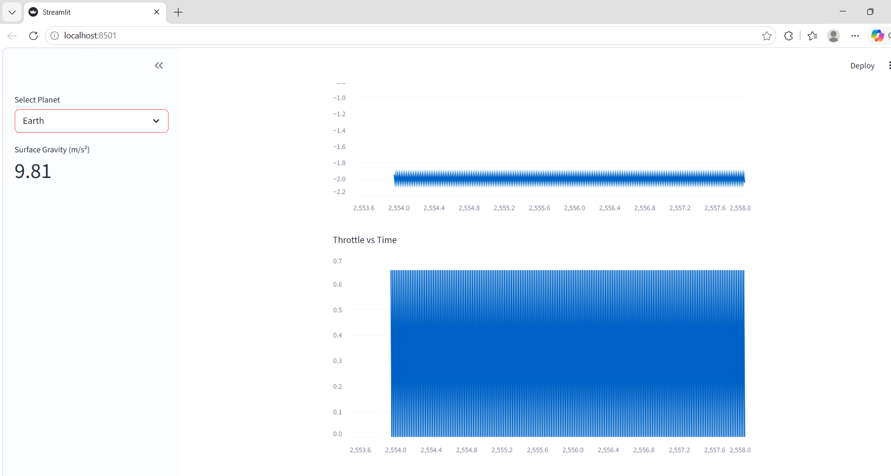

# Autonomous Rocket Landing Simulator 🚀

A physics-based rocket landing simulator with a real-time telemetry dashboard.

This project models a rocket descending from high altitude while controlling thrust and fuel consumption. Flight telemetry is recorded and visualized using an interactive dashboard.

---

## Features

• Planetary gravity simulation (Earth, Moon, etc.)

• Physics-based rocket descent model
- altitude
- velocity
- acceleration
- thrust control

• High-resolution telemetry logging
- 250,000+ rows of flight data

• Interactive mission control dashboard built with Streamlit

• Telemetry visualizations:
- Altitude vs Time
- Velocity vs Time
- Throttle vs Time
- Fuel vs Time
- Altitude vs Fuel Consumption

• Mission summary metrics including final descent velocity

---

## Technologies Used

Python

Pandas

Matplotlib

Streamlit

---

## Dashboard Preview

The dashboard displays real-time rocket telemetry similar to a mission control console.

Key plots include:

• Altitude vs Time — full descent trajectory from 5000 m  
• Velocity vs Time — descent velocity profile  
• Throttle vs Time — thrust modulation during landing  
• Fuel vs Time — fuel consumption during descent  
• Altitude vs Fuel — relationship between descent and fuel burn

---

## Running the Simulator

1. Clone the repository

2. Install dependencies

pip install -r requirements.txt

3. Launch the dashboard

streamlit run dashboard/app.py


## Project Structure

rocket-landing-simulator/

simulator/  
physics.py  
rocket.py  
telemetry.py

dashboard/  
app.py

data/  
telemetry.csv

README.md

---


---

## 📊 Telemetry Dashboard




## Future Improvements

• Real-time simulation instead of pre-recorded telemetry

• PID autopilot controller for autonomous landing

• Additional planetary environments (Mars, Titan)

• 3D trajectory visualization


## ⚙️ How to Run

```bash
pip install -r requirements.txt
streamlit run dashboard/app.py

## Author

Geoffrey Okwi